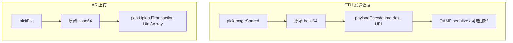

# 图片选图与上传处理

本文档说明 OAM 在 **ETH 发送数据（内嵌图片）** 与 **AR 文件上传** 两条路径中，如何从用户设备读取图片、是否修改字节、以及上链前的后续步骤。

**原则：应用不主动压缩、重编码或转换用户选择的图片格式。** 体积与手续费由用户自行权衡；需要压缩时请使用外部工具。

## 1. 总览

| 功能 | 选图入口 | 实现文件 | 上链方式 |
| :--- | :--- | :--- | :--- |
| ETH 内嵌图片 | 发送页 → 相册 / 文件 | `src/adapter/pickImageShared.ts` | `mypayload` HTML + OAMP 交易 `data` |
| AR 上传 | 上传页 → 相册 / 文件 | `src/arweave/upload/pickFile.ts` | Arweave 交易 `data` + 标签 |

远程附件（Arweave ID/URI、HTTP URL）**不包含**本地图片字节，不在本文档范围。

## 2. ETH 发送数据（内嵌图片）

### 2.1 调用链

- UI：[`src/screens/SendDataScreen.tsx`](../src/screens/SendDataScreen.tsx) 通过 `getImagePickerAdapter()` 调用各平台 adapter。
- 选图：[`src/adapter/pickImageShared.ts`](../src/adapter/pickImageShared.ts) 中的 `pickImageFromLibrary`、`pickImageFromFiles`，统一经 `finalizePickedImage` 处理。
- 编码：[`src/mypayload/index.ts`](../src/mypayload/index.ts) 的 `createJpegItem` / `createPngItem` / `createGifItem` 为 base64 加上 `data:image/...;base64,` 前缀，再 `payloadEncode` 写入 ``。**此阶段不压缩图片。**

### 2.2 支持的类型与来源

| 来源 | 允许 MIME | 对字节的处理 |
| :--- | :--- | :--- |
| 相册 | JPEG、PNG、GIF | 读取 picker / 文件系统提供的 base64，**不**经 `ImageManipulator` |
| 文件 | JPEG、PNG、GIF（DocumentPicker 类型过滤） | 同上 |

### 2.3 GIF 特殊说明

- 相册调用 `launchImageLibraryAsync` 时**不**设置会破坏 GIF 的 `quality` 参数（避免 iOS 将 GIF 转为 JPEG）。
- `finalizePickedImage` 仅校验 base64 解码后文件头是否为 `GIF`，校验失败则拒绝该文件。

### 2.4 不支持

- 相册/文件选图路径**不支持** HEIC、WebP 等（`finalizePickedImage` 对非 jpeg/png/gif 返回 `null`）。
- 用户仍可通过 **远程附件** 引用 Arweave 或 URL 上的 HEIC 等文件。

### 2.5 体积提示

UI 文案建议合并文本与内嵌图数据控制在约 **100kB** 以内（`send.payloadSizeHint`）。原图更大时，交易更容易因 gas / 节点限制失败，属预期行为。

## 3. AR 文件上传

### 3.1 调用链

- UI：[`src/arweave/upload/screens/UploadScreen.tsx`](../src/arweave/upload/screens/UploadScreen.tsx)
- 选图/选文件：[`src/arweave/upload/pickFile.ts`](../src/arweave/upload/pickFile.ts)
- 上传：[`src/arweave/upload/transaction.ts`](../src/arweave/upload/transaction.ts) — `uploadBase64ToUint8Array` 解码后 `createTransaction` + `post` 至 `arweave.net`。**不压缩。**

### 3.2 相册（`pickUploadFileFromGallery`）

| 类型 | 处理 |
| :--- | :--- |
| JPEG、PNG | 原始字节（`asset.base64` 或 `readBase64FromUri`） |
| GIF | 原始字节 + GIF 文件头校验 |
| HEIC/HEIF | 原始字节，MIME/`fileType` 保持 `heic`，**不**转为 JPEG |
| 其他（如 AVIF、JXL） | 不支持，返回 null |

`allowsEditing: false`，无裁切。`preferredAssetRepresentationMode: Current` 由系统决定提供的资源表示形式。

### 3.3 文件（`pickUploadFileFromDocuments`）

- 类型：`*/*`，按扩展名 / 系统 MIME 推断类型（见 `fileTypes.ts`）。
- 字节：**原样读取**，无压缩、无转码。

### 3.4 体积与网关

- 文案建议单文件 **10MB 以内**更稳（`arweave.upload.fileSizeHint`）。
- 上传网关固定为 `arweave.net:443`（与读图多网关 fallback 无关）。

## 4. 应用不做的事（明确边界）

- 不对 JPEG/PNG 做质量系数重编码（历史上曾使用 `compress: 0.8`，已移除）。
- AR 路径不对 HEIC 做 HEIC→JPEG 转换（历史上存在，已移除）。
- 不在 `payloadEncode` / `postUploadTransaction` 阶段做 gzip 或二次图像处理。
- OAMP 加密仅增加密文开销，**不**改变明文图像内容。

## 5. 平台层可能的变化（非本应用逻辑）

iOS/Android 相册 API 可能返回转码后的表示（例如某些 HEIC 资源）。应用在拿到 `base64` 或文件 URI 后**不再二次处理**；若需保证与磁盘文件逐字节一致，应使用「文件」选择器指向具体文件。

## 6. 相关常量与读图（非上传）

- 从 Arweave **读取**远程图片时，[`src/constants/index.ts`](../src/constants/index.ts) 的 `ARWEAVE_GATEWAYS` 会按顺序尝试多个网关 — **仅用于下载/展示**，不影响上传字节。
- GraphQL 列表查询使用多 endpoint fallback，与上传交易无关。

## 7. 变更记录

| 日期 | 说明 |
| :--- | :--- |
| 2026-09 | 取消 ETH/AR 选图阶段的 JPEG/PNG 压缩与 AR 相册 HEIC→JPEG；确立「不改动用户数据」策略并成文。 |
